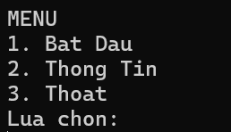

### Hướng Dẫn Chơi

Khi bắt đầu, bạn sẽ thấy giao diện **Menu** chính của trò chơi.

#### Điều Khiển
- Sử dụng các phím mũi tên hoặc phím **W/A/S/D** trên bàn phím để điều khiển hướng di chuyển của rắn.

#### Mục Tiêu
- Hướng dẫn rắn ăn các mẩu thức ăn xuất hiện ngẫu nhiên trên màn hình.
- Mỗi lần ăn thức ăn, rắn sẽ dài hơn và điểm số của bạn sẽ tăng lên.

#### Kết Thúc Trò Chơi
- Trò chơi kết thúc nếu rắn va vào tường hoặc chính cơ thể của nó.
- Sau khi kết thúc, điểm số của bạn sẽ được hiển thị. Bạn có thể:
- Quay lại menu để chơi lại.

#### Giao Diện Menu

- **Chọn 1**: Bắt đầu trò chơi.
- **Chọn 2**: Xem hướng dẫn và thông tin thành viên nhóm 8.
    
- **Chọn 3**: Thoát khỏi trò chơi.
